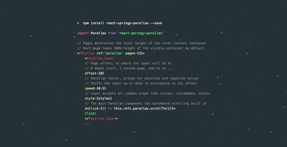

A springy, composable parallax-scroller for React.

    npm install react-springy-parallax --save

Demo: http://react-springy-parallax.surge.sh

Simple example: http://react-springy-parallax-simple.surge.sh

Example source: https://github.com/drcmda/react-springy-parallax/blob/master/example/index.js

More complex example: https://github.com/drcmda/awv3node-homepage (the one in the thumbnail)



<b>How to use</b>

```js
import Parallax from 'react-springy-parallax'

// Pages determines the total height of the inner content container
// Each page takes 100% height of the visible outer container by default
<Parallax ref='parallax' pages={3}>

    // Add as many layers as you like
    <Parallax.Layer
        // Page offset, or where the layer will be at when scrolled to
        // 0 means start, 1 second page, 1.5 second and half, and so on ...
        offset={0}
        // Parallax factor, allows for positive and negative values
        // Shifts the layer up or down in accordance to its offset
        speed={0.5}>

        <span>Layers can contain anything</span>

    </Parallax.Layer>

</Parallax>
```

<b>Can the effect be configured or muted?</b>

Yes, you can use anything the Animated library offers: http://browniefed.com/react-native-animation-book

```js
import Animated from 'animated/lib/targets/react-dom'
import Easing from 'animated/lib/Easing'

<Parallax
    effect={(animation, toValue) =>
        Animated.timing(animation, { toValue, duration: 200, easing: Easing.elastic(2) })}
    ... >
```

Or a zero timer for a tame, old-school parallax:

```js
effect={(animation, toValue) =>
    Animated.timing(animation, { toValue, duration: 0 })}
```

<b>Is it possible disable the scroll bar for custom page navigation?</b>

Yes. In this mode it will also make sure window-resize retains the last page seen.

You can always use `scrollTo`, scroll bar or not, there is no restriction.

```js
<Parallax
    ref={ref => this.parallax = ref}
    scrolling={false}
    ... >
    <Parallax.Layer>
        <div onClick={() => this.parallax.scrollTo(1)}>
            Click to get to the next page
```

<b>Does it scroll horizontally as well?</b>

Sure does.

```js
<Parallax horizontal ... >
```